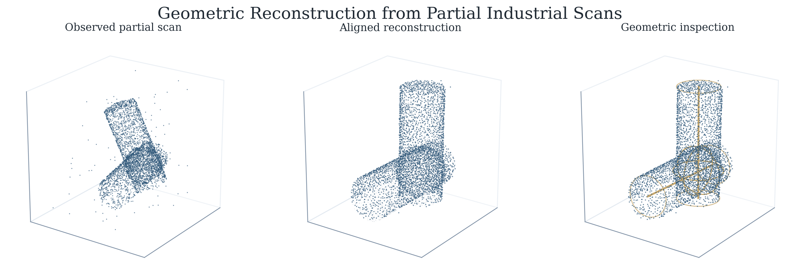
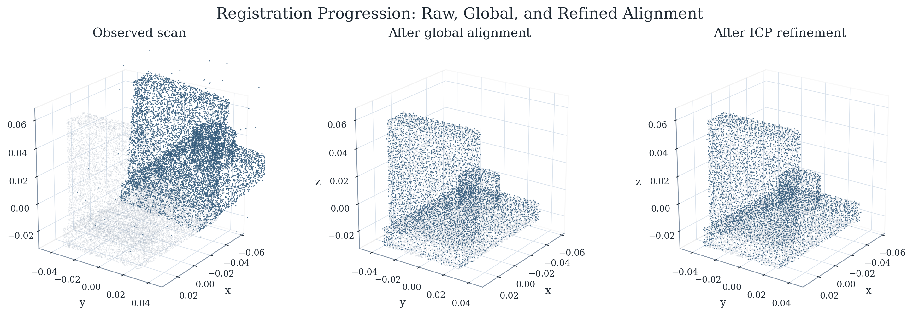
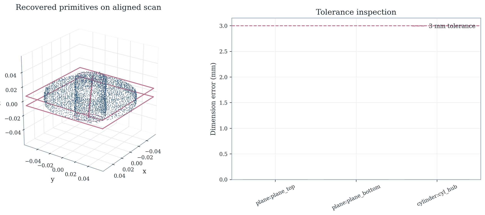
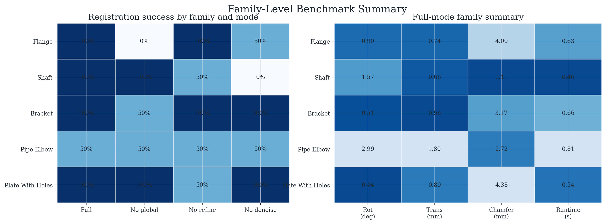
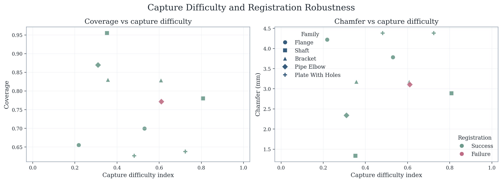
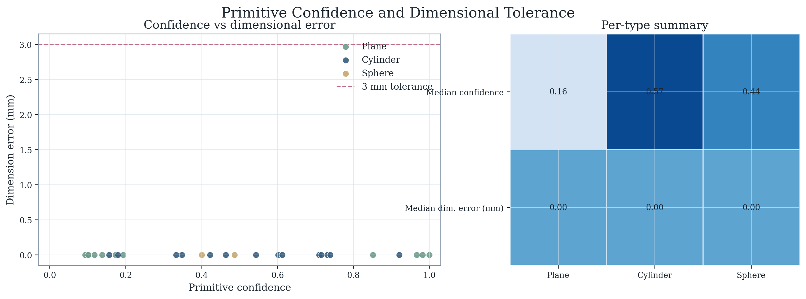
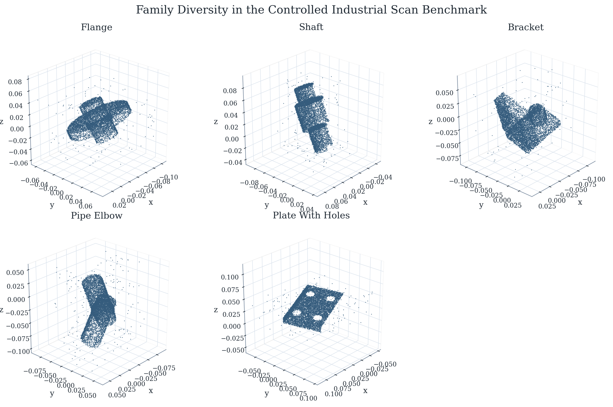
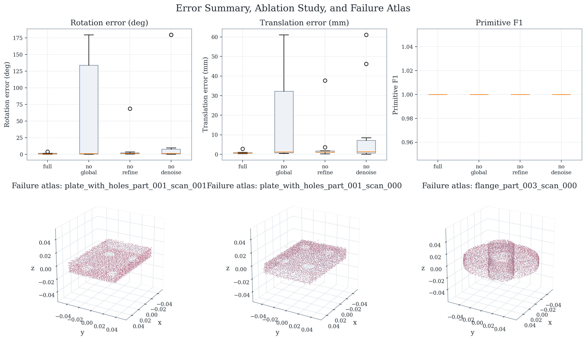
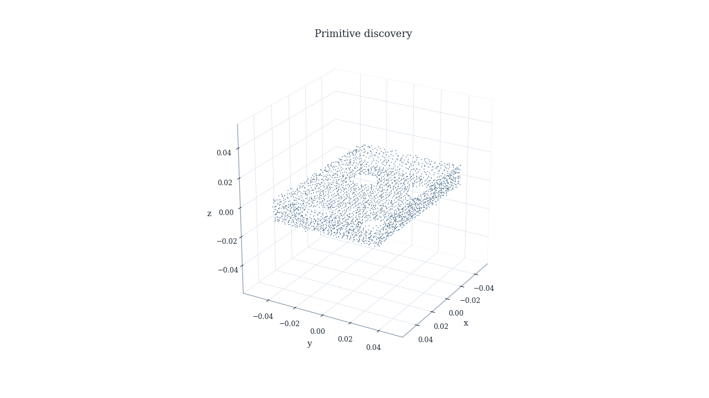

# Geometric Reconstruction and Inspection from Partial Industrial Scans

This repository presents an industrial scan benchmark for reconstructing, aligning, and inspecting mechanical parts from partial 3D observations.

<p align="center">
  
</p>

## Benchmark Highlights

Held-out benchmark run: `run_20260320_171809`

| Metric | Result |
| --- | ---: |
| Registration success | `90.0%` |
| Median rotation error | `0.94 deg` |
| Median translation error | `0.71 mm` |
| Median Chamfer distance | `3.17 mm` |
| Median primitive F1 | `1.00` |
| Median coverage | `77.6%` |

## Visual Results

<p align="center">
  
  
</p>

<p align="center">
  
  
</p>

<p align="center">
  
  
</p>

<p align="center">
  
</p>

## Motion Demos

<p align="center">
  
  
  
</p>

## What the System Does

- Registers partial scans to reference geometry with global and local alignment.
- Refines recovery for industrial parts with symmetry-aware evaluation and family-specific stability checks.
- Recovers planes, cylinders, and spheres for inspection-oriented analysis.
- Reports pose accuracy, coverage, Chamfer distance, primitive F1, and dimensional tolerance.
- Exports figures, videos, summaries, and per-scan reports for side-by-side benchmark comparison.

## Benchmark Setup

The benchmark covers five industrial part families:

- `flange`
- `shaft`
- `bracket`
- `pipe_elbow`
- `plate_with_holes`

Each record includes reference geometry, partial scan observations, pose annotations, and primitive labels for evaluation. The benchmark is designed to stress reference-aligned recovery under varying occlusion, noise, outliers, and view coverage.

## Repository Layout

```text
configs/default.yaml
docs/media/
recon/benchmark_parts.py
recon/pipeline.py
recon/primitives.py
recon/make_figures.py
recon/make_videos.py
tests/
```

## Quick Start

Install the project:

```powershell
python -m venv .venv
.venv\Scripts\Activate.ps1
python -m pip install --upgrade pip
python -m pip install -e .[dev]
```

Generate the benchmark and run the evaluation:

```powershell
python -m recon.generate_dataset
python -m recon.run_pipeline --split test --ablation-suite
python -m recon.make_figures --run-dir artifacts/runs/<run_name>
python -m recon.make_videos --run-dir artifacts/runs/<run_name>
```

## Reproducibility and Outputs

Running the pipeline produces:

- benchmark manifests, reference geometry, and scan records
- per-mode summary JSON and CSV reports
- per-scan reports and saved registration stages
- figure exports and animated demos for qualitative review

The media embedded in this README is mirrored under `docs/media/` for stable GitHub rendering.
